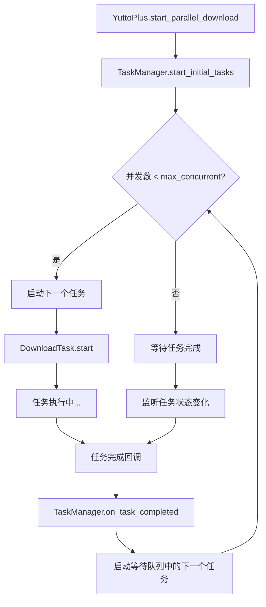
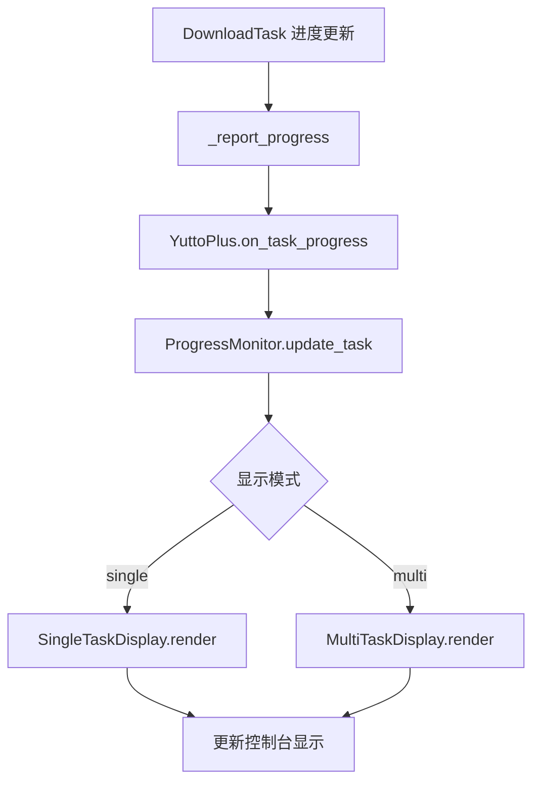

# 并行下载系统设计方案

## 🎯 需求概述

实现一个智能的并行下载管理系统，让 YuttoPlus 能够同时管理多个 DownloadTask，并提供美观的多任务进度显示。

## 🏗️ 系统架构

### 核心组件关系

```
YuttoPlus (主调度器)
├── TaskManager (任务管理器)
│   ├── TaskQueue (任务队列: 等待/执行/完成)
│   ├── ThreadPool (线程池管理)
│   └── TaskScheduler (智能调度器)
├── ProgressMonitor (进度监控器)
│   ├── MultiTaskDisplay (多任务显示)
│   ├── SingleTaskDisplay (单任务显示)  
│   └── TaskStatusTracker (状态跟踪)
└── DownloadTask[] (多个下载任务)
    ├── 保留现有功能
    └── 新增: 向上报告机制
```

## 📋 详细设计

### 1. YuttoPlus 主调度器改造

#### 1.1 新增属性
```python
class YuttoPlus:
    def __init__(self, max_concurrent=3, **config):
        # 现有属性...
        self.max_concurrent = max_concurrent          # 最大并行数
        self.task_manager = TaskManager(max_concurrent)
        self.progress_monitor = ProgressMonitor()
        self.active_tasks = {}                        # {task_id: DownloadTask}
        self.task_counter = 0                         # 任务ID计数器
        
    # 现有方法保持不变...
```

#### 1.2 新增方法
```python
# 批量添加任务
def add_download_tasks(self, urls_with_configs: List[Tuple[str, Dict]]) -> List[str]:
    """添加多个下载任务，返回任务ID列表"""
    
def start_parallel_download(self, display_mode='auto') -> None:
    """开始并行下载，display_mode: 'single'/'multi'/'auto'"""
    
def pause_all_tasks(self) -> None:
    """暂停所有任务"""
    
def resume_all_tasks(self) -> None:
    """恢复所有任务"""
    
def get_overall_progress(self) -> Dict:
    """获取整体进度信息"""
```

### 2. TaskManager 任务管理器

#### 2.1 任务队列管理
```python
class TaskManager:
    def __init__(self, max_concurrent: int):
        self.max_concurrent = max_concurrent
        self.pending_queue = deque()          # 等待队列
        self.running_tasks = {}              # 正在执行的任务
        self.completed_tasks = {}            # 已完成任务
        self.failed_tasks = {}               # 失败任务
        self.thread_pool = ThreadPool(max_concurrent)
        
    def add_task(self, task_id: str, download_task: DownloadTask):
        """添加任务到队列"""
        
    def start_next_task(self):
        """启动下一个等待的任务"""
        
    def on_task_completed(self, task_id: str, success: bool):
        """任务完成回调，触发下一个任务"""
        
    def get_queue_status(self) -> Dict:
        """获取队列状态统计"""
```

#### 2.2 智能调度逻辑
```python
class TaskScheduler:
    def select_next_task(self, pending_tasks: List, running_tasks: Dict) -> Optional[str]:
        """智能选择下一个要执行的任务
        
        调度策略:
        1. 优先级高的任务
        2. 预估文件小的任务 (快速完成)
        3. 同UP主的任务延后 (避免频繁请求)
        4. 负载均衡考虑
        """
        
    def estimate_task_size(self, task: DownloadTask) -> int:
        """预估任务大小 (用于调度优化)"""
        
    def should_throttle_requests(self, task: DownloadTask) -> bool:
        """是否需要限流 (同UP主任务间隔)"""
```

### 3. ProgressMonitor 进度监控器

#### 3.1 多任务显示模式
```python
class MultiTaskDisplay:
    def __init__(self, max_columns=3):
        self.max_columns = max_columns
        self.current_layout = []
        
    def render_progress(self, tasks_info: Dict[str, TaskInfo]):
        """渲染多任务进度显示
        
        示例输出:
        ┌─────────────────────┬─────────────────────┬─────────────────────┐
        │ BV1Zx411w7Ug       │ BV1Ly411k7Ds       │ BV1AB4y1k7Gp       │
        │ 【教程】如何使用... │ 【科技】AI技术解析  │ 【游戏】最新攻略    │
        │ ████████████░░░░    │ ██████░░░░░░░░░░    │ ██░░░░░░░░░░░░░░    │
        │ 75.2% 850.5/1130MB │ 45.8% 234.2/511MB  │ 12.3% 67.8/550MB   │
        │ ⚡ 12.5 MB/s        │ ⚡ 8.7 MB/s         │ ⚡ 15.2 MB/s        │
        │ 🎥 1080P AVC        │ 🎥 720P HEVC        │ 🎥 1080P AV1        │
        │ ⏱️ 剩余 00:22       │ ⏱️ 剩余 00:31       │ ⏱️ 剩余 01:05       │
        └─────────────────────┴─────────────────────┴─────────────────────┘
        
        队列状态: 等待 2 | 执行中 3 | 已完成 5 | 失败 0
        整体进度: ████████████████░░░░ 80.5% | 总速度: 36.4 MB/s
        """
        
    def update_single_task(self, task_id: str, task_info: TaskInfo):
        """更新单个任务的显示"""
        
    def format_task_column(self, task_info: TaskInfo) -> List[str]:
        """格式化单个任务的显示列"""
```

#### 3.2 单任务显示模式
```python
class SingleTaskDisplay:
    def render_progress(self, task_info: TaskInfo):
        """单任务详细显示
        
        示例输出:
        📹 BV1Zx411w7Ug - 【教程】如何使用YuttoPlus下载B站视频
        👤 UP主: 科技区老司机
        
        📊 整体进度: ████████████████░░░░ 82.5% (1.85GB/2.24GB)
        ⚡ 下载速度: 15.2 MB/s | ⏱️ 剩余时间: 00:25
        
        📹 视频流: ████████████████░░░░ 85.2% (1.25GB/1.47GB) | 12.8 MB/s
        🔊 音频流: ███████████████████░ 95.8% (600MB/626MB)   | 2.4 MB/s
        
        🎯 质量: 1080P AVC | 🔊 音质: 320kbps | 📁 输出: ./downloads/
        """
```

### 4. DownloadTask 改造

#### 4.1 向上报告机制
```python
class DownloadTask:
    def __init__(self, url, config, task_config=None, task_id=None, parent_manager=None):
        # 现有代码...
        self.task_id = task_id
        self.parent_manager = parent_manager  # 指向 YuttoPlus
        
    def _report_progress(self, progress_info: Dict):
        """向父管理器报告进度"""
        if self.parent_manager:
            self.parent_manager.on_task_progress(self.task_id, progress_info)
            
    def _report_status_change(self, new_status: TaskStatus):
        """报告状态变化"""
        if self.parent_manager:
            self.parent_manager.on_task_status_change(self.task_id, new_status)
            
    def _report_completion(self, success: bool, result_info: Dict, error: str):
        """报告任务完成"""
        if self.parent_manager:
            self.parent_manager.on_task_completed(self.task_id, success, result_info, error)
```

#### 4.2 静默模式
```python
class DownloadTask:
    def __init__(self, ..., silent_mode=False):
        self.silent_mode = silent_mode  # 是否静默（不直接输出）
        
    def _print_if_not_silent(self, message: str):
        """只在非静默模式下输出"""
        if not self.silent_mode:
            print(message)
```

## 🔄 执行流程

### 1. 批量任务添加流程

```python
# 使用示例
downloader = YuttoPlus(max_concurrent=3)

# 添加多个任务
tasks = [
    ("https://www.bilibili.com/video/BV1Zx411w7Ug", {"quality": 80}),
    ("https://www.bilibili.com/video/BV1Ly411k7Ds", {"quality": 64}),
    ("https://www.bilibili.com/video/BV1AB4y1k7Gp", {"audio_only": True}),
]

task_ids = downloader.add_download_tasks(tasks)
downloader.start_parallel_download(display_mode='multi')
```

### 2. 调度执行流程



### 3. 进度监控流程



## 🎨 用户界面设计

### 1. 命令行参数扩展

```bash
# 新增并行相关参数
python yutto-plus.py --batch urls.txt --max-concurrent 5 --display-mode multi
python yutto-plus.py --max-concurrent 2 --queue-info "url1" "url2" "url3"

# 兼容现有单任务模式
python yutto-plus.py "single_url"  # 自动使用 display-mode=single
```

### 2. 配置文件支持

```yaml
# yutto-plus-config.yaml
parallel:
  max_concurrent: 3
  display_mode: auto  # auto/single/multi
  auto_start: true
  
scheduling:
  priority_by_size: true
  throttle_same_uploader: 5  # 秒
  retry_failed_tasks: 3

display:
  refresh_rate: 0.5  # 秒
  max_columns: 3
  show_eta: true
  show_speed: true
```

## 📊 状态管理

### 1. 任务状态枚举扩展

```python
class TaskStatus(Enum):
    PENDING = "pending"       # 等待中
    QUEUED = "queued"         # 已排队  
    EXTRACTING = "extracting" # 信息提取中
    DOWNLOADING = "downloading" # 下载中
    MERGING = "merging"       # 合并中
    COMPLETED = "completed"   # 已完成
    FAILED = "failed"         # 失败
    PAUSED = "paused"         # 已暂停
    CANCELLED = "cancelled"   # 已取消
```

### 2. 进度信息数据结构

```python
@dataclass
class TaskProgressInfo:
    task_id: str
    status: TaskStatus
    video_info: Dict
    progress_percentage: float
    current_bytes: int
    total_bytes: int
    download_speed: float
    eta_seconds: int
    selected_streams: Dict
    error_message: str = None
    
@dataclass
class OverallProgressInfo:
    total_tasks: int
    pending_tasks: int
    running_tasks: int
    completed_tasks: int
    failed_tasks: int
    overall_progress: float
    total_speed: float
    eta_seconds: int
```

## 🔧 实现优先级

### 阶段1: 核心并行管理 (高优先级)
- [ ] TaskManager 基础实现
- [ ] 任务队列管理
- [ ] 基础并行执行
- [ ] DownloadTask 报告机制

### 阶段2: 进度显示 (中优先级)  
- [ ] MultiTaskDisplay 实现
- [ ] SingleTaskDisplay 优化
- [ ] 控制台显示刷新机制

### 阶段3: 智能调度 (中优先级)
- [ ] TaskScheduler 实现
- [ ] 任务大小预估
- [ ] 负载均衡优化

### 阶段4: 用户体验 (低优先级)
- [ ] 命令行参数扩展
- [ ] 配置文件支持
- [ ] 暂停/恢复功能
- [ ] 任务优先级设置

## 🧪 测试方案

### 1. 单元测试
- TaskManager 队列管理
- TaskScheduler 调度逻辑
- ProgressMonitor 显示格式

### 2. 集成测试
- 多任务并行下载
- 任务失败恢复
- 显示模式切换

### 3. 性能测试
- 不同并发数性能对比
- 内存使用监控
- 网络带宽利用率

这个设计方案提供了完整的并行下载管理系统架构，既保持了现有功能的完整性，又增加了强大的并行处理能力。你觉得这个方案如何？我们可以从哪个部分开始实现？ 